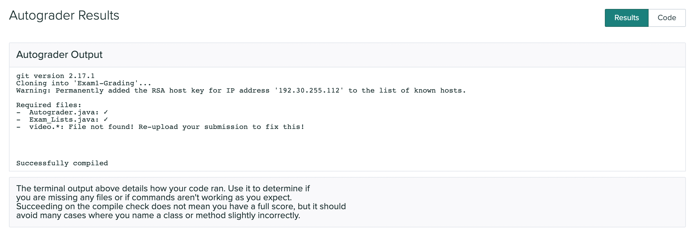

# Exam 1

### Release: 6pm Thursday April 14, 2022
### Due: 8am Sunday April 17, 2022

**We will not accept late submissions. There will be no exceptions.**

This page details a take-home exam that you will complete over the next few
days. You can’t communicate with anyone about the content of the assignment
until the exam has concluded. **DO NOT** post clarification or other similar questions as staff will not be answering these types of questions during this time period. If there are broken links or otherwise strange parts of the writeup, you may post these concerns on piazza. If you have technical trouble creating a screencast (detailed below) feel free to reach out for assistance.

Do not use any online service other than Piazza to ask questions about the
assignment. Do not search for, solicit, or use solutions to the problems that
you find elsewhere for the exam. These are all violations of academic integrity
that students have committed on exams like this in the past.

You can make use of any course notes, online resources about Java and its
libraries, Java tools, and so on to complete the exam, including re-using code
from class notes or PAs.

You can review the grading policy for exams in the [syllabus](https://ucsd-cse12-sp22.github.io/syllabus.html).
You will complete the programming task below and submit your work to the `Exam1` Gradescope assignment.

Starter code is available here:

[https://github.com/ucsd-cse12-sp22/cse12-exam1-starter](https://github.com/ucsd-cse12-sp22/cse12-exam1-starter)

Submission checklist (see long descriptions below for full details):

- [ ] `Exam_Lists.java`
- [ ] `Autograder.java`
- [ ] `video.*` (`*` means whatever extension you have; we *really* prefer `mp4`, which is what Zoom produces. If you use an extension other than mp4, check that it plays in Gradescope!)

Make sure to look at your Gradescope submission after submitting to see if all the required files are there.


### **Task 1 and 2 will be autograded. Task 3 will be manually graded** 

Make sure that your submission passes autograder for your code to be properly graded. 

If you are having issues with getting the autograder to run successfully, you may find it helpful to consult the [Developing with the Gradescope Autograder in Mind](https://docs.google.com/document/d/1IKSDkG4kHC0gb2FyqdeOWJOAbQr6UCvYZSToIBopfVs/edit?usp=sharing) guide.

If your submission passes the autograder, then you should see output similar to:



Be aware that the Compile check does not check for code correctness, but rather that your code compiles. Additionally, if your code errors or throws exceptions unexpectedly, the autograder will not grade your submission. This will result in 0 points being given for that particular task.

Your submission will be graded **after** the deadline. You should test thoroughly yourself to make sure your program works as expected.

## Clarifications

**Can I use a Java feature/library/method that we haven't covered in class?**

Yes (unless otherwise specified), just make sure it doesn't break the autograder. The course staff is not responsible for fixing any submissions that fail the autograder during or after the exam. 

**Can we write more methods than specified?**

Yes, you can write additional helper methods.

**Can I use previous code that I wrote for a PA in my exam?**

Yes.


## Task 1 – Lists
**You may not import Java's builtin ArrayList or LinkedList to complete this task**

You will be writing your code in `Exam_Lists.java`. You will creating two new generic classes called `Exam_AList` and `Exam_LList`, both representing your own implementation of an arraylist and linkedlist that implements the given `Exam_List` interface shown below.

```java
interface Exam_List<E> {
    void add(E element);
    void flipAround(E element);
    E[] toArray();
}
```

You are free to implement these three methods in any way you wish without relying on Java's builtin ArrayList or LinkedList. 

You will implement all 3 of the following methods for both `Exam_AList` and `Exam_LList`.

### Task 1.1 add
The `add` method will take in a single generic parameter and will add it to the end of the list.

### Task 1.2 flipAround
The `flipAround` method will take in a single generic parameter and will flip the rest of the elements of the list around that element. The order of the flipped elements will be preserved. If the element does not exist in the list, throw a `NoSuchElementException` with no error message. 

Below is an example of how this method would function on an array. Note that this is not a valid test for your implementation.
```java
Consider the following:
int[] a = {1, 2, 3, 4, 5};
assertEquals({4, 5, 3, 1, 2}, a.flipAround(3));
```

### Task 1.3 toArray
The `toArray` method will take no parameters and will return the list as an array the contains **only** the added elements. Hint: This means that there should be no `null`s in the returned array unless `null` was explicitly added the the list.

## Task 2 – Stack and Queue

You will be writing your code in a file called `Autograder.java`. You will be recreating a simplified version of the autograder queue we use for this class. To help you, we have provided the `Exam_SQ` interface and two classes that implement it, `Exam_Stack` and `Exam_Queue`, representing a stack and queue respectively. 

You will add 2 classes, `Ticket` and `Autograder`. 

### Task 2.1 Ticket
You will add a class called `Ticket` that will contain a single field of type `String`. It will contain a default constructor which initializes the field to an empty string. 

You will add 3 methods: `accept`, `cancel` and `toString`.

- The `accept` method will set the field's value to `"accepted"` (match the case exactly and do not include `"`)

- The `cancel` method will set the field's value to `"canceled"` (match the case exactly and do not include `"`)

- The `toString` method will override the default `toString` method and return `"Ticket on Autograder"` if the field is set to the empty string. Otherwise it will return the string `"Ticket has been "` and the status of the ticket as described by the `String` field. (match the case exactly, notice there is a space after `been` and do not include `"`)

### Task 2.2 Autograder
You will add a class called `Autograder` which will have a single field of type `Exam_SQ<Ticket>`. `Autograder` will have a single constructor that takes as a parameter a list of type `Exam_SQ<Ticket>` and initializes its field with this list.

You will add 3 methods: `add`, `accept`, and `cancel`.

- The `add` method will take a single parameter of type `Ticket` and add it to the `Autograder` list.

- The `accept` will accept the next ticket in the list and set the ticket's status to `accepted`. If there are no tickets, then throw an `Exception` with the error message `"Autograder is empty"`. (Do not include `"`)

- The `cancel` will cancel the next ticket in the list and set the ticket's status to `canceled`. If there are no tickets, then throw an `Exception` with the error message `"Autograder is empty"`. (Do not include `"`)

## Task 3 - Video

You will record a short video of no more than 10 minutes. You are not expected to use the entirety of the allotted time, but it is given to provide enough buffer for you to complete the video task.

Tip: If you find yourself running out of time, you might be explaining your code too much. If the task does not ask you to directly explain your code, you don't need to explain it. 

Include:

- Show only your face and a picture ID (your student ID is preferred but any
picture ID with your name on it will work) for a few seconds at the beginning.
You don’t have to be on camera the whole time, though it’s fine if you are. Just
a brief confirmation that it’s you creating the video/doing the work attached to
the work itself is what we want. If you do not have a webcam, take a picture of
yourself (and your picture ID) with your phone and display that picture at the
start of your screen share.
- You must also verbally explain your thought process as you complete the following tasks.
- You may use any technology to create the memory diagrams.

**Note**: Gradescope has a max file size of 100MB. Any files larger than this will be rejected. We will **NOT** accept any files (code, videos, etc.) outside of the gradescope submission. Additionally make sure that you are able to play your video on gradescope. If your video is not playable on gradescope by staff, then it will not be graded and given a score of 0.

To reduce video file sizes:
- Use zoom
    - A 100MB video is about a 20 minute video on Zoom (1620x1080 video resolution).
    - If you are not using Zoom, convert your file to an MP4 (there are web tools that can do this). MP4 videos have smaller video sizes than other video formats.
- Use a smaller screen size for your computer, or only record a smaller portion of the screen.
- Reduce background clutter (i.e. desktop icons). Background clutter reduces compression, making larger file sizes. You can hide the background by maximizing your code editor window.
- Keep your video short. 
    - 10 minutes is the max, it’s possible to cover everything in less time
    - Create a script of what you are going to say.
    - Pause the video as you switch to the code for the next question (make sure to tell us which question you are showing the code for when you switch).
- Use a 3rd party video editor to reduce the width/height of the video, but make sure your code isn't blurry when you play it on Gradescope as we cannot grade blurry videos.


### Task 3.1 Lists 
Trace and draw a memory diagram of a single call of `flipAround` on `Exam_LList`. Your example should have at least 5 elements. You may choose any element to flip around. Trace through **all** lines of code in the `flipAround` method and updating the memory diagram as you trace lines that change references. 
- You may prepare this test before the filming of your video.
- You may prepare a memory diagram with the initial state of the linkedlist's memory after all `add` calls, but before any `flipAround` calls
- You must show that your implementation correctly passes the test(s) you wrote

### Task 3.2 Stack and Queue
Pick 2 implementations of `Autograder`, one that takes `Exam_Stack` and one that takes `Exam_Queue` as a parameter to its constructor. Trace and draw a memory diagram of **4** calls of `add` and **4** calls of any combination of `Autograder.accept()` or `Autograder.cancel()`. Additionally update your memory diagram as objects get manipulated. Be sure to include the `Autograder` list and all 4 `Ticket` objects as part of your memory model and mention significant keywords / phrases relevant to stacks and queues.
- You may prepare all the relevant code for your 2 implementations of `Autograder`, the 4 `Ticket` objects, the method calls, and tests prior to the filming of your video.
- You must create and fill in the memory diagram **during the video**. 
- You must show that both of your implementations correctly pass the test(s) you wrote
